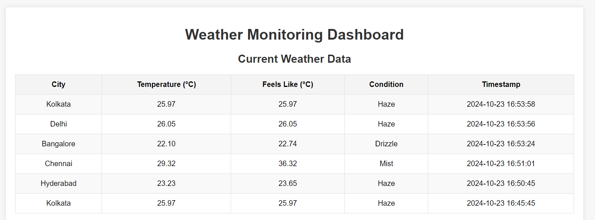
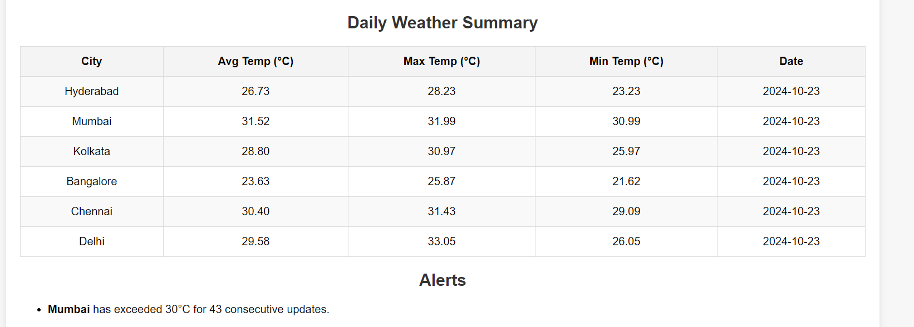
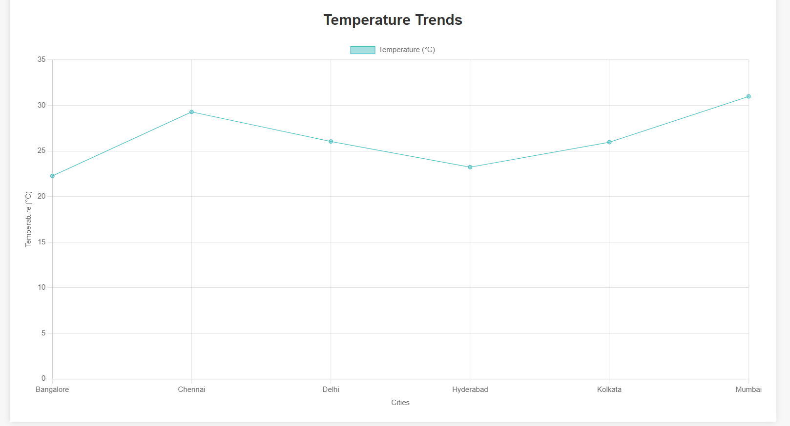

# Real-Time Data Processing System

## Overview

The Real-Time Data Processing System is designed to monitor and analyze weather data in real time. It aggregates weather information, generates daily summaries, and triggers alerts based on user-defined thresholds. This project serves as a powerful tool for understanding weather patterns and receiving timely notifications of significant changes in weather conditions.

## Project Structure
Real-Time Data Processing System /config/config.py # Configuration settings for the application /db/create_tables.py # Script to create necessary database tables /src/fetch_weather.py # Module to fetch weather data from the API /src/process_data.py # Module to process and analyze weather data /src/visualize.py # Module to visualize weather data and summaries /static/css/style.css # CSS styles for the web application /static/js/script.js # JavaScript for front-end functionality /templates/index.html # HTML template for the main web interface /app.py # Main application logic and API endpoints /main.py # Entry point for running the application /requirements.txt # List of dependencies required for the project


## Features

### 1. Daily Weather Summary
- Roll up the weather data for each day.
- Calculate daily aggregates for:
  - Average temperature
  - Maximum temperature
  - Minimum temperature
  - Dominant weather condition (determined by the most frequently reported condition for the day).
- Store the daily summaries in a database for further analysis.

### 2. Alerting Thresholds
- Define user-configurable thresholds for temperature or specific weather conditions (e.g., alert if temperature exceeds 35 degrees Celsius for two consecutive updates).
- Continuously track the latest weather data and compare it with the thresholds.
- Trigger alerts for current weather conditions if a threshold is breached. Alerts can be displayed in the console or sent via an email notification system.

### 3. Visualizations
- Implement visualizations to display:
  - Daily weather summaries
  - Historical trends
  - Triggered alerts

## Getting Started

1. **Clone the repository:**
   ```bash
   git clone <repository_url>
   cd Real-Time Data Processing System
   ```
2. **Install the dependencies:**
   ```bash
   pip install -r requirements.txt
   ```
3. **Set up the database:**
   Run ```create_tables.py``` to set up the necessary database tables.
4. **Run the application:**
   ```bash
   python main.py
   ```
5. **Access the application:**
   Open your web browser and navigate to ```http://127.0.0.1:5000/```

## output
  
*Displays the most recent weather data fetched from the API.*

  
*Shows the daily weather summary, including average, maximum, and minimum temperatures.*
*Illustrates alerts triggered based on predefined temperature thresholds.*

  
*Visual representation of temperature trends over time, highlighting changes in weather patterns.*
